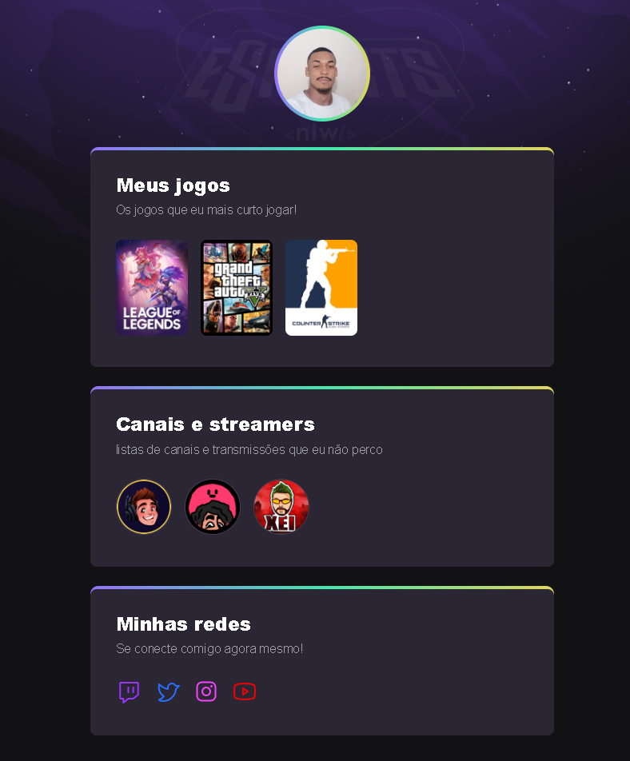

# NLW eSports - Trilha Explorer

Projeto construído do evento Next Level Week da Rockeseat.

[Clique aqui para acessar](https://gustadeveloperr.github.io/nlw-esports-explorer/)

# Tecnologias

- HTML
- CSS
- Git e GitHub

# O que Aprendi

A rockeseat superou as minhas expectavivas com sua metodologia de ensino prático e teórico. Embora o conteúdo seja extenso para um período curto de tempo, a aplicação permitiu-me absorver todo o conteúdo e agregar, ainda mais, conhecimentos sobre tais tecnologias. Dentre os ensinamentos destacam-se a forma de torna meu projeto público (URL) e criar commits que permite observar o histórico do projeto (Updates), álem disso tudo, o readme que é uma forma pratica de ler e conhcer o projeto.

# Contato

gustavoplnr14@gmail.com
